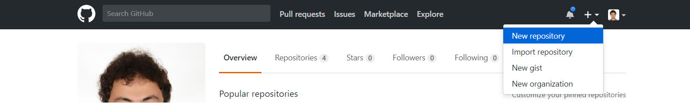
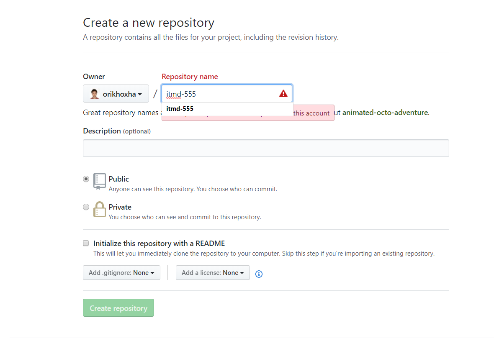
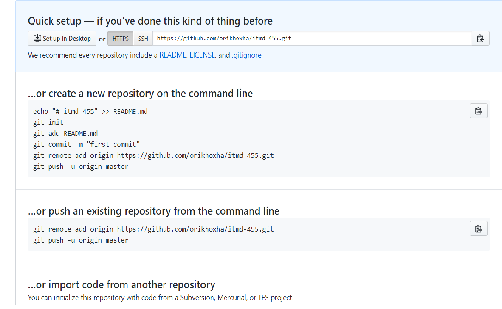
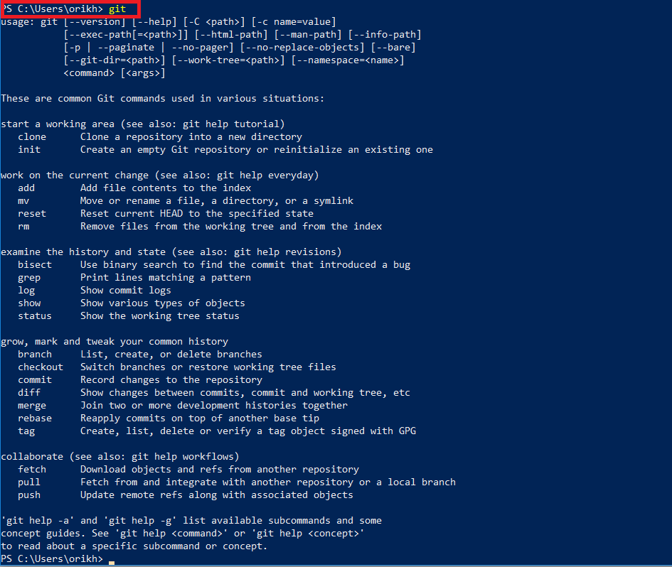
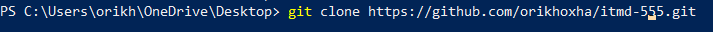
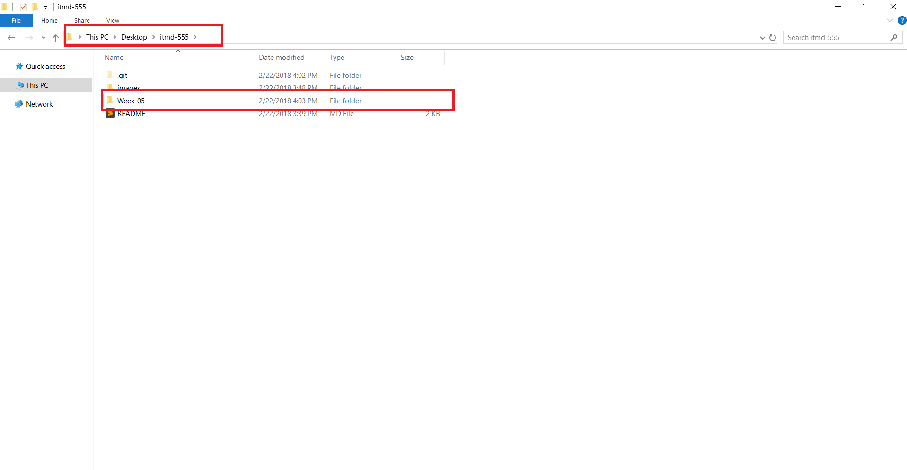
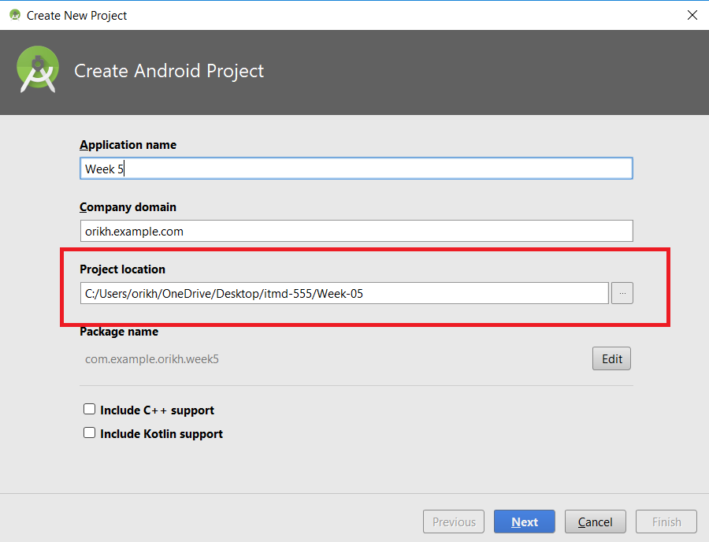
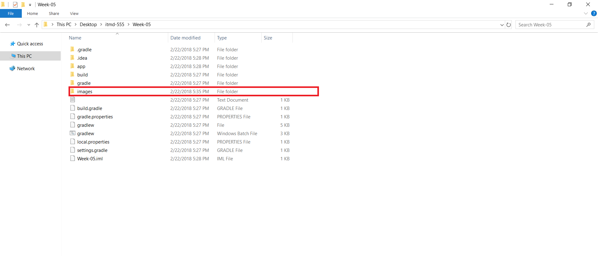

## Setting up the github account

1. Create a Github account, set a username and password.

2. Create a new repository

3. Name your repository itmd-x55, (x replace 4 or 5 based on your level of study)

4. After the repository has been created you will see this page

5. Download Git from this link https://git-scm.com/downloads. Choose the proper link based on the operating system you are using.

*** Go to Command Line Prompt (CMD) and run the following command: **git** 

The **git** command should be recognized by the system.

6. Clone the repository from github to the local filesystem using the following command. Please replace the repository link your own repository.

**git clone https://github.com/orikhoxha/itmd-455.git** 

7. Create a new folder within the repository cloned from github. Name it "Week-0X" , replace X with the current week assignment you are working on.

8. Create a new project in Android Studio and save within the directory "Week-0X" created from the step 7.	

9. After completing your application, make the screenshots **only from the application running, not the Java or xml files**

10. Create a folder with name **images** within the **Week-0X** directory

11. Place the screenshots in **images** folder.

