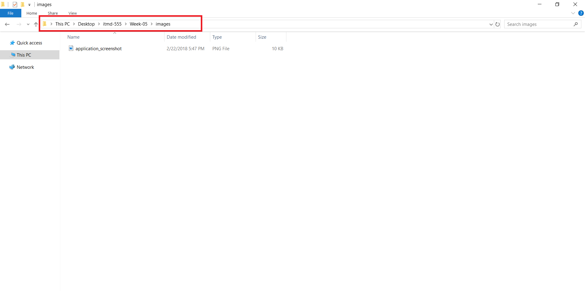
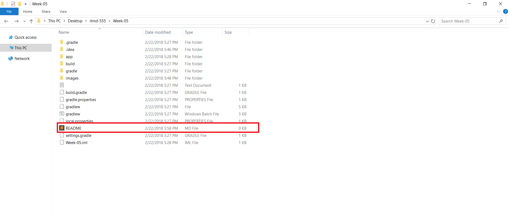
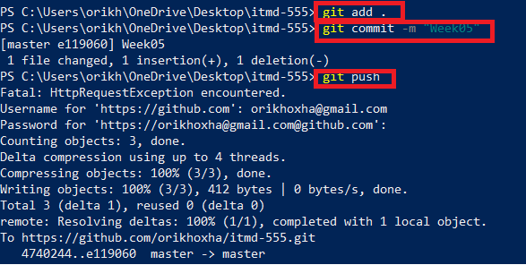

## Setting up & pushing Android Project to a Github repository


1. Create a Github account, set a username and password.


2. Create a new repository


3. Name your repository itmd-x55, (x replace 4 or 5 based on your level of study)


4. After the repository has been created you will see this page


5. Download Git from this link https://git-scm.com/downloads. Choose the proper link based on the operating system you are using.

*** Go to Command Line Prompt (CMD) and run the following command: **git** 

The **git** command should be recognized by the system.


6. Clone the repository from github to the local filesystem using the following command. Please replace the repository link your own repository.

**git clone https://github.com/orikhoxha/itmd-455.git** 


7. Create a new folder within the repository cloned from github. Name it "Week-0X" , replace X with the current week assignment you are working on.


8. Create a new project in Android Studio and save within the directory "Week-0X" created from the step 7.	


9. After completing your application, make the screenshots **only from the application running, not the Java or xml files**

10. Create a folder with name **images** within the **Week-0X** directory

11. Place the screenshots in **images** folder.




12. Create a README.md file within folder "Week-0X"




13. Read this cheatsheet on how to reference images from READMD.md file https://github.com/adam-p/markdown-here/wiki/Markdown-Cheatsheet

Example ``````       The example references an image inside images folder


14. After all the steps have been completed run the following commands




15. ```git add . ```   This command adds all the files to the Git local system
16. ```git commit -m "Committing" ``` This command commits the added files
17. ```git push ```  This command pushes the changes made in the local Git repository to the Github


